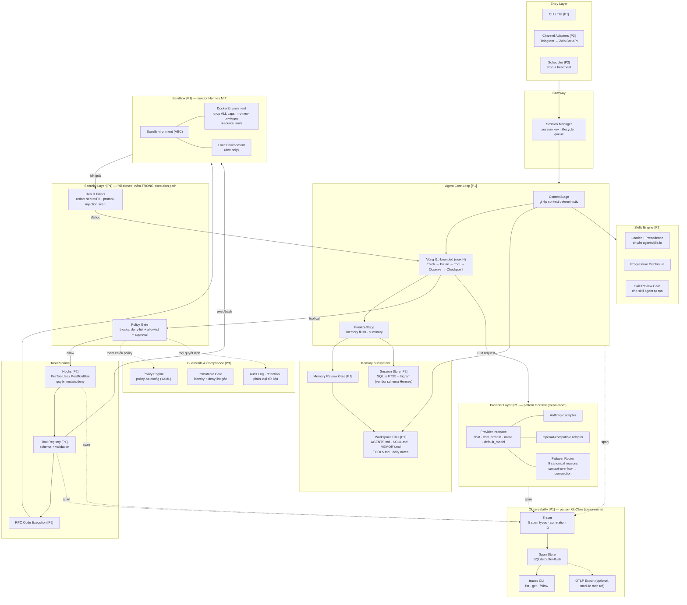
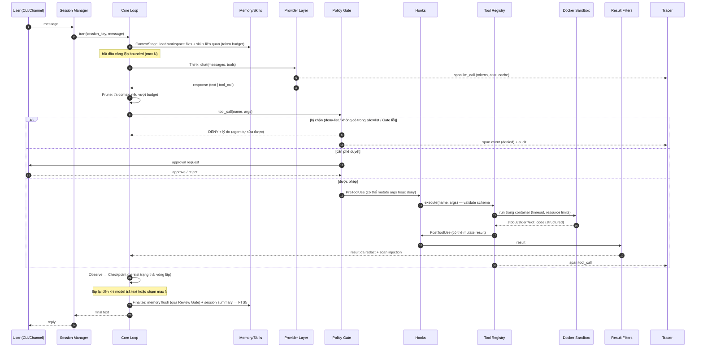

# Harness Architecture Design — Sơ đồ kiến trúc & mô tả thành phần

> **Trạng thái:** Draft để team review · 04/07/2026
> **Đầu vào:** `harness-master-plan.md` (ma trận nguồn §3, lộ trình §4)
> **Ràng buộc thiết kế:** Python ≥3.11 · single-tenant (deploy-per-tenant) · on-prem, Docker sandbox · fail-closed · no-egress
> **Quy ước:** Nhãn `[P0]`/`[P1]`/`[P2]`/`[P3]` = phase xuất hiện theo master plan. Nhận định chưa kiểm chứng đánh dấu **[Inference]**.

---

## 1. Sơ đồ tổng thể



**Ba bất biến của sơ đồ (không được vẽ lại khác đi):**
1. **Không có đường nào từ `LOOP` đến `SBX` mà không qua `GATE`** — mọi tool call bắt buộc xuyên Policy Gate trước; Gate lỗi = deny (fail-closed).
2. **Không có đường nào từ `SBX` về `LOOP` mà không qua `FILT`** — mọi tool result bị lọc secret/PII/prompt-injection trước khi vào context.
3. **`OTLP` là đường ra ngoài duy nhất và là optional** — mặc định tắt; mọi store (span, session, workspace) đều local. Đây là bằng chứng kiến trúc cho cổng no-egress.

---

## 2. Luồng một turn (sequence)



---

## 3. Mô tả từng thành phần

### 3.1 Entry Layer

| | |
|---|---|
| **Trách nhiệm** | Nhận input từ người dùng/lịch, chuẩn hoá thành `InboundMessage`, đẩy vào Session Manager. Không chứa logic nghiệp vụ. |
| **Thành phần** | `[P1]` CLI/TUI (kênh duy nhất của MVP — đủ để demo 2 cổng). `[P3]` Channel adapters: Telegram trước (Bot API public, dễ nhất), Zalo Bot API sau (cấu trúc giống Telegram — đã verify). `[P2]` Scheduler cũng là một entry (xem 3.10). |
| **Interface chính** | `ChannelAdapter`: `receive() -> InboundMessage`, `send(session_key, OutboundMessage)`. Mỗi adapter một package, core không biết chi tiết kênh. |
| **Nguồn** | Mẫu config/gating per-channel từ OpenClaw `docs/channels/*` (MIT). **Loại trừ:** Zalo Personal (lib unofficial), WeChat (plugin đóng Tencent). |

### 3.2 Gateway / Session Manager

| | |
|---|---|
| **Trách nhiệm** | Quản lý vòng đời session: map `session_key` → conversation state; queue message khi turn đang chạy (không chạy 2 turn song song trong 1 session); phát sự kiện lifecycle cho Hooks. |
| **Luồng dữ liệu** | Vào: `InboundMessage` từ Entry. Ra: gọi `CoreLoop.turn()`; nhận final text trả về adapter. |
| **Thiết kế** | Single-tenant nên KHÔNG có user isolation/RBAC — một process phục vụ một trust boundary (mô hình "one user/trust boundary per gateway" của OpenClaw, đã verify là posture họ khuyến nghị). Concurrency: worker pool đơn giản, không cần lane-based scheduler của GoClaw. |
| **Nguồn** | BUILD, tham khảo khái niệm session/mainKey của OpenClaw docs. |

### 3.3 Agent Core Loop `[P1]`

| | |
|---|---|
| **Trách nhiệm** | Trái tim của harness. Cấu trúc theo pattern GoClaw V3 (clean-room từ `docs/01-agent-loop.md`): **setup một lần → vòng lặp bounded → finalize**. |
| **Các stage** | **ContextStage** (1 lần/turn): ghép context *deterministic* — system prompt + workspace files + skills liên quan + N message gần nhất, tất cả trong token budget khai báo trước. **Think**: gọi Provider. **Prune** (mỗi vòng): tỉa context khi vượt budget — tool result cũ bị thay bằng tham chiếu. **Tool**: thực thi qua Security→Hooks→Registry. **Observe**: nhận result đã lọc vào context. **Checkpoint** (mỗi vòng): persist trạng thái vòng lặp xuống SQLite — kill process giữa chừng thì resume được. **FinalizeStage** (1 lần/turn): flush memory qua Review Gate, ghi session summary vào FTS store. |
| **Bất biến** | Vòng lặp có trần cứng (mặc định 20 vòng **[Inference — số cần tune]**); mỗi vòng phát span; không stage nào gọi thẳng sandbox hay provider mà không qua lớp tương ứng. |
| **Vì sao pattern này** | Prune và Checkpoint là 2 stage đa số harness thiếu — giải trực tiếp bài token budget và failure recovery (tiêu chí xuyên suốt §4 tài liệu gốc). |

### 3.4 Provider Layer `[P1]`

| | |
|---|---|
| **Trách nhiệm** | Cô lập core khỏi mọi chi tiết provider. Đổi model/provider = đổi config, không đụng core. |
| **Interface** | 4 method theo pattern GoClaw (clean-room): `chat()`, `chat_stream()`, `name()`, `default_model()`. Response chuẩn hoá: text + tool_calls + usage (tokens in/out/cache) + stop_reason. Python: `Protocol`/ABC. |
| **Thành phần** | 2 adapter v0.1: **Anthropic** + **OpenAI-compatible** (một adapter phủ nhiều vendor — đúng cách GoClaw đạt "20+"). **Failover Router**: phân loại lỗi theo 9 canonical reasons; riêng **context-overflow → kích hoạt compaction, KHÔNG failover** (failover không sửa được nguyên nhân). Retry/backoff exponential + jitter. Prompt caching bật cho Anthropic/OpenAI. |
| **Luồng dữ liệu** | Vào: messages + tool schemas từ Think. Ra: response chuẩn hoá; mỗi call phát span `llm_call` (usage + cost tính từ bảng giá config). API key: đọc từ env/secret file, mã hoá at-rest nếu lưu **[Inference — quyết định khi làm config]**. |

### 3.5 Security Layer `[P1]` — nằm TRONG execution path

Hai nửa, đúng sơ đồ gốc "Blocks / Filters":

**Policy Gate (Blocks)** — chặn TRƯỚC khi thực thi:
- Thứ tự đánh giá: `hardline deny-list` (không bao giờ override được: `rm -rf /`, egress ngoài whitelist, đọc secret store...) → `allowlist` per-deployment → `approval tier` (manual/smart; **không có YOLO** trong build gov) → mặc định **DENY**.
- **Fail-closed:** Gate exception/timeout → DENY. Có test bắt buộc cho case này (DoD 1.4).
- Deny trả về lý do dạng agent-đọc-được ("lệnh X bị chặn bởi rule Y, thử Z") — đúng tiêu chí "error message agent tự sửa được".
- `[P3]` Gate chuyển từ deny-list hard-coded sang đọc **Policy Engine** (3.11) — interface giữ nguyên từ P1 để không phải sửa call-site.

**Result Filters** — lọc SAU khi thực thi, TRƯỚC khi vào context:
- Redact secret/PII (pattern + entropy scan **[Inference — kỹ thuật cụ thể chọn khi design chi tiết]**).
- Prompt-injection scan trên tool result (web_fetch, file đọc từ ngoài) — result nghi vấn bị bọc cảnh báo hoặc chặn.

**Nguồn:** taxonomy approval 3 mức + hardline blocklist từ Hermes security docs; permission matrix từ GoClaw docs 09/23 (clean-room); OpenClaw THREAT-MODEL-ATLAS làm threat checklist (bài học ngược — default của họ là thứ ta phải đảo).

### 3.6 Tool Runtime

| | |
|---|---|
| **Tool Registry `[P1]`** | Đăng ký tool: name + JSON schema + handler. Validate input trước handler; lỗi validate trả message agent-sửa-được. Tool v0.1: `exec` (→ sandbox), `read_file`, `write_file`, `web_fetch` (qua egress whitelist). `[P2]` bộ tool use-case local: `ssh_exec`/`log_read` (qua SSH backend + host profile, hardline cấm lệnh xóa file OS), `vpn` (openvpn/fortinet, credentials không vào context), `db_query`/`db_config` (read-only 4 lớp, hardline cấm ALTER/DELETE/UPDATE — spec `harness-local-use-case.md` §4). Registry là nguồn sinh tool schema cho Provider và stub cho RPC. |
| **Hooks `[P2]`** | Điểm cắm lifecycle: `PreToolUse` (được **mutate args hoặc deny**), `PostToolUse` (được mutate result), `session:compact:before/after`, `agent:bootstrap`, `gateway:startup/shutdown` — taxonomy theo OpenClaw. Handler = Python entry point khai báo trong config. Ràng buộc: hook có timeout riêng, lỗi hook không giết agent (log + span rồi bỏ qua — trừ hook được đánh dấu `enforcing` thì lỗi = deny). Khác biệt so với OpenClaw: hooks của ta là **policy enforcement point** thực thụ nhờ quyền mutate/deny. |
| **RPC Code Execution `[P2]`** | Viết lại từ design Hermes (không vendor code — có issues #41/#7071): sinh stub Python typed từ Registry → script chạy trong **container** → tool call proxy qua socket về Registry (vẫn xuyên Policy Gate từng call) → caps: timeout/stdout/số call. Giá trị: gom pipeline nhiều bước thành 1 lượt không tốn context. Test checklist = chính 2 issue của Hermes. |

### 3.7 Sandbox `[P1]` — vendor từ Hermes (MIT)

| | |
|---|---|
| **Trách nhiệm** | Mọi lệnh exec chạy cô lập; stdout/stderr/exit thành structured result; timeout + resource limits. |
| **Thành phần** | Vendor `tools/environments/`: `base.py` (ABC `BaseEnvironment` — subclass chỉ implement `_run_bash()` + `cleanup()`; base lo session lifecycle, wait/kill, CWD tracking), `docker.py` (backend chính — hardening sẵn: drop ALL caps, no-new-privileges, resource limits), `local.py` (dev only, bị Policy Gate chặn trong build production **[Inference — cần enforce bằng config]**), `ssh.py` `[P2]` (remote ops cho use-case local — chỉ đến host trong profile config, lệnh phân lớp qua Gate với hardline cấm xóa file, xem `harness-local-use-case.md` §3), `file_sync.py` (sync host↔container). Bỏ 3 backend còn lại (singularity/modal/daytona). |
| **Network của container** | Mặc định `network=none`; tool cần mạng (web_fetch) đi qua proxy có egress whitelist — không cho container mở kết nối tuỳ ý. **[Inference — thiết kế chi tiết ở design doc sandbox]** |
| **Vì sao vendor** | Module tự chứa duy nhất trong 3 repo vendor được nguyên vẹn (đã verify từng import); giữ ABC nên thêm Singularity sau này (khách cấm Docker) chỉ là thêm 1 file. |

### 3.8 Memory Subsystem

| | |
|---|---|
| **Workspace Files `[P1]`** | Format OpenClaw (MIT, implement từ spec docs): `AGENTS.md` (operating instructions), `SOUL.md` (persona), `TOOLS.md` (guidance), `MEMORY.md` (long-term, chỉ main session), daily notes `memory/YYYY-MM-DD.md` (auto-load hôm nay+hôm qua). Loader chạy trong ContextStage với **token budget khai báo** — vượt budget thì truncate theo thứ tự ưu tiên. Triết lý giữ nguyên: "model chỉ nhớ những gì ghi xuống đĩa — không có hidden state" → git-diff được, audit được. |
| **Memory Review Gate `[P1]`** | Agent KHÔNG ghi thẳng `MEMORY.md`. Đề xuất ghi vào staging (`memory/pending/`), người vận hành (hoặc `[P3]` policy rule) duyệt merge. Đây là điểm khác biệt chủ đích so với cả 3 repo (đều cho agent tự ghi). |
| **Session Store `[P2]`** | Vendor schema `hermes_state.py`: SQLite WAL, bảng `sessions`/`messages`/`messages_fts` (FTS5) + `messages_fts_trigram` (substring/CJK — tiếng Việt hưởng lợi **[Inference]**) + `schema_version` migrations. Tool `session_search` trả **message gốc** (không LLM summarization — bài học từ vụ README Hermes nói quá). FinalizeStage ghi summary ngắn/session để search có mồi. |
| **Defer** | Semantic/KG (pattern GoClaw 3-tier + RRF): chỉ mở khi FTS5 đo được là không đủ. Schema đã chừa cột/bảng mở rộng. |

### 3.9 Skills Engine `[P2]`

| | |
|---|---|
| **Format** | Chuẩn **agentskills.io**: thư mục chứa `SKILL.md` (YAML frontmatter: name, description, version + body markdown). Cả OpenClaw lẫn Hermes theo chuẩn này → skill hệ sinh thái dùng lại được. |
| **Precedence** | Rút gọn từ 6 tier của OpenClaw xuống 3 cho single-tenant: `workspace` → `managed` (do người vận hành cài) → `bundled`. Cao đè thấp. |
| **Progressive disclosure** | ContextStage chỉ nạp *danh sách* name+description của mọi skill (rẻ); body SKILL.md chỉ nạp khi model chọn dùng — không vỡ context. Chất lượng `description` quyết định trigger đúng → có lint rule cho description khi cài skill. |
| **Skill Review Gate** | 2 behavior port từ Hermes (policy/prompt logic): auto-draft skill sau task thành công 5+ tool calls; patch skill khi dùng thấy lỗi. Nhưng skill do agent tạo/sửa nằm ở staging đến khi được duyệt (tham khảo `skills_guard.py`/`skill_provenance.py` của Hermes làm reference cho khâu review — scan code trong skill, ghi provenance). |

### 3.10 Scheduler `[P2]`

| | |
|---|---|
| **Trách nhiệm** | Đánh thức agent theo lịch. 3 syntax theo spec OpenClaw: `at` (ISO-8601/relative), `every` (interval), `cron` (5-6 field, croniter). Persist SQLite → sống qua restart. |
| **Heartbeat** | Turn định kỳ trong main session với checklist `HEARTBEAT.md`; contract kiểu `HEARTBEAT_OK` để suppress reply rỗng (không spam kênh). Kiêm liveness: heartbeat miss N lần → alert/restart. |
| **Bất biến** | **Chống overlap**: job đang chạy thì lần trigger kế bị skip + ghi span event (không xếp hàng chồng). |

### 3.11 Guardrails & Compliance `[P3]`

| | |
|---|---|
| **Policy Engine** | Policy-as-config (YAML): rule = điều kiện trên (tool, args, session, giờ, phân loại dữ liệu) → hiệu ứng (allow/deny/approve/redact). Policy Gate `[P1]` chuyển sang đọc engine này qua cùng interface. Tự thiết kế 100% — differentiator chính, không repo nào có fail-closed policy engine. |
| **Immutable Core** | Pattern mutable/immutable từ GoClaw docs 21 (clean-room): agent được đề xuất sửa style/CAPABILITIES qua review gate, **không bao giờ** sửa được identity, hardline deny-list, policy file (mount read-only trong runtime **[Inference — cơ chế cụ thể ở design doc]**). |
| **Compliance layer** | Audit log append-only (mọi quyết định Gate + mọi approval + mọi ghi memory/skill), phân loại dữ liệu, retention policy theo yêu cầu khách. BUILD — đặc thù VN/gov, không có nguồn. |

### 3.12 Observability `[P1]`

| | |
|---|---|
| **Trách nhiệm** | Mọi model/tool/hook call có span + correlation ID, **replay được** một turn từ trace. Có từ commit đầu, không bolt-on. |
| **Thiết kế** | Pattern GoClaw docs 10 (clean-room): 5 span types — `agent` (turn), `llm_call`, `tool_call`, `embedding`, `event` (deny, checkpoint, heartbeat-skip...). Token/cost chỉ aggregate từ `llm_call` (tránh đếm đôi). Buffer in-memory → flush batch vào SQLite (GoClaw dùng 1000 span/5s — số của ta tune sau **[Inference]**). |
| **Cost ledger** | Mọi call đến provider bên ngoài có phí — **LLM (`llm_call`), embedding, image_gen, web_search** — đều ghi vào span: provider, model/endpoint, đơn vị dùng (tokens in/out/cache, số ảnh, số query) và **cost tính từ bảng giá trong config** (`config/pricing.yaml` — giá thay đổi theo thời gian nên không hard-code). Truy vấn được theo provider/model/ngày/session ngay từ span store: `harness usage --by provider --month 2026-07`. Budget cảnh báo: ngưỡng chi tiêu tháng trong config, heartbeat kiểm tra và báo khi chạm 80%/100% **[Inference — ngưỡng mặc định chốt khi implement]**. Lưu ý: cost tính từ bảng giá là **ước tính** — đối soát định kỳ với billing dashboard của provider, chênh lệch lớn là bug phải điều tra. |
| **Đầu ra** | CLI: `harness traces list/get/follow` + `export`, `harness usage` (tổng chi theo provider/model/ngày). `[P3]` analytics (`/usage`, `/insights` — mẫu Hermes) đọc từ chính span store, không thu thập thêm. **OTLP export là module tách rời, mặc định TẮT** — bật chỉ khi khách có collector on-prem. Logs JSON đi qua cùng bộ redact của Result Filters (không lộ secret). |

---

## 4. Bố trí dữ liệu trên đĩa (tất cả local)

```
<deploy-root>/
├── workspace/              # memory con người đọc được (git-friendly)
│   ├── AGENTS.md  SOUL.md  TOOLS.md  MEMORY.md  HEARTBEAT.md
│   ├── memory/YYYY-MM-DD.md          # daily notes
│   ├── memory/pending/               # Memory Review Gate staging
│   └── skills/<slug>/SKILL.md        # workspace-tier skills
├── state/
│   ├── sessions.db         # SQLite: sessions + messages + FTS5 + trigram
│   ├── traces.db           # SQLite: span store
│   └── scheduler.db        # SQLite: cron jobs + checkpoint vòng lặp
├── config/
│   ├── harness.yaml        # provider, budget, sandbox, channels
│   └── policy/*.yaml       # [P3] policy engine — mount read-only
└── audit/
    └── audit-YYYY-MM.jsonl # [P3] append-only
```

**[Inference]** Tách 3 file SQLite (sessions/traces/scheduler) thay vì 1: khác vòng đời backup/retention, giảm lock contention; review lại khi design chi tiết.

---

## 5. Kiến trúc đáp ứng 2 cổng sống/chết như thế nào

| Cổng | Bằng chứng trong kiến trúc |
|---|---|
| **(a) No-egress** | Mọi store là file/SQLite local (§4); container mặc định `network=none`; đường ra ngoài duy nhất là web_fetch qua egress whitelist + OTLP optional mặc định tắt. Test P1: network monitor xác nhận zero kết nối ngoài whitelist trong suốt một turn. |
| **(b) Fail-closed trong execution path** | Bất biến #1-#2 của sơ đồ §1: không đường vòng qua Gate/Filters; Gate exception → DENY (có test riêng); hooks `enforcing` lỗi → deny; policy `[P3]` mount read-only, agent không sửa được. |

---

*Tài liệu này là kiến trúc mức hệ thống; mỗi thành phần P1 sẽ có design doc chi tiết riêng khi bắt đầu implement (theo spec clean-room từ Phase 0). Nguồn pattern: xem ma trận §3 của `harness-master-plan.md`.*
