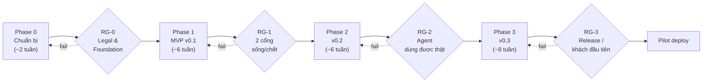
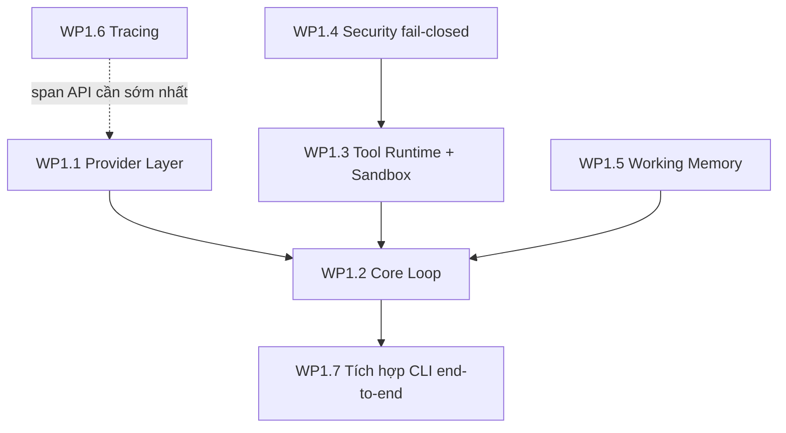

# Harness Execution Plan — Kế hoạch chi tiết với Red Gates

> **Trạng thái:** Draft để team review · 04/07/2026
> **Đầu vào:** `harness-master-plan.md` (lộ trình 4 phase) + `harness-architecture-design.md` (kiến trúc, bất biến)
> **Mục tiêu tài liệu:** chia nhỏ đến mức task giao được cho 1 người, có dependency, có Definition of Done (DoD), và **red gate** chặn cứng giữa các chặng — đi hết plan này là ra sản phẩm v0.3 deploy được cho khách đầu tiên.
> **Quy ước:** ước lượng thời gian là **[Inference]** dựa trên quy mô task, cần team calibrate lại sau sprint đầu. Task ID = `P<phase>.<wp>.<task>`.

---

## 1. Cơ chế Red Gate

**Red gate (RG)** = cổng chặn cứng giữa các chặng. Quy tắc:

1. **Không pass → không đi tiếp.** Fail gate = quay lại rework, không "nợ" tiêu chí sang chặng sau. Không có ngoại lệ theo tiến độ.
2. **Mọi tiêu chí phải có bằng chứng kiểm chứng được** (evidence): test tự động trong CI, bản ghi demo, hoặc tài liệu được ký duyệt. "Đã làm rồi, tin tôi đi" không phải bằng chứng.
3. **Tiêu chí gate viết trước khi code** (chính là tài liệu này) — không viết lại tiêu chí cho khớp với thứ đã build.
4. **Người duyệt gate ≠ người làm** hạng mục đó. Tối thiểu: tech lead duyệt gate kỹ thuật; legal/lead duyệt RG-0.
5. Gate fail 2 lần liên tiếp cùng một tiêu chí → dừng, họp xem lại thiết kế (không tiếp tục vá).
6. Kết quả mỗi lần chạy gate ghi vào `docs/gates/RG-<n>-<date>.md`: từng tiêu chí PASS/FAIL + link bằng chứng + người duyệt.

Bên cạnh red gate theo chặng có **guard thường trực (AG — always-on gate)** chạy trong CI từ khi được kích hoạt, đỏ là block merge:

| ID | Guard thường trực | Kích hoạt từ |
|---|---|---|
| AG-1 | Bộ test fail-closed (Gate lỗi → deny) không được xoá/skip | P1.4 |
| AG-2 | Test no-egress (network monitor trong integration test) | P1.6 |
| AG-3 | Lint license header trên `vendor/` + CI chặn import từ đường dẫn ngoài vendor manifest | P0.2 |
| AG-4 | Secret scan trên diff + test redact filter | P1.4 |
| AG-5 | Checklist RPC security (từ Hermes issues #41/#7071) là test suite, không phải tài liệu | P2.5 |

---

## 2. Bản đồ chặng và gate

**[Inference]** Tổng ~22 tuần (5–5.5 tháng) với 2–3 dev; con số calibrate lại sau RG-1.

---

## 3. Phase 0 — Chuẩn bị (~2 tuần [Inference])

### Work packages

| Task | Nội dung | Phụ thuộc | DoD |
|---|---|---|---|
| P0.1.1 | Chỉ định clean-room reader; viết quy trình 1 trang (reader chỉ đọc GoClaw `docs/`, cấm mở `*.go`; log URL đã đọc) | — | Quy trình được legal/lead ký |
| P0.1.2 | Spec nội bộ **Provider interface** (từ GoClaw docs 02, bằng lời của reader) | P0.1.1 | Spec đủ để dev implement không cần hỏi lại nguồn |
| P0.1.3 | Spec nội bộ **Tracing model** (từ docs 10) | P0.1.1 | nt |
| P0.1.4 | Spec nội bộ **Agent loop V3** (từ docs 01) | P0.1.1 | nt |
| P0.1.5 | Spec nội bộ **Permission matrix** (từ docs 09, 23) | P0.1.1 | nt |
| P0.2.1 | Vendor intake Hermes: `tools/environments/{base,local,docker,file_sync}.py` → `vendor/hermes_environments/` + LICENSE + manifest ghi commit SHA nguồn | — | Test standalone: mở Docker session → chạy lệnh → nhận structured result → cleanup |
| P0.2.2 | Vendor intake schema `hermes_state.py` → `vendor/hermes_state/` (chỉ schema + FTS5 workaround) | — | Tạo db, migrate, insert, FTS5 + trigram query chạy |
| P0.3.1 | Skeleton Python: layout package theo kiến trúc §3, pyproject.toml pin exact deps, pre-commit | — | `pip install -e .` + import mọi package OK |
| P0.3.2 | CI: lint + test + build container + AG-3 | P0.3.1 | CI xanh; PR thử có import lậu từ vendor bị chặn |
| P0.4.1 | Threat model v0 (checklist từ OpenClaw THREAT-MODEL-ATLAS + exposure-runbook, áp lên posture của ta) | — | Tài liệu 1–2 trang, được review, liệt kê threat → control tương ứng trong kiến trúc |

### 🔴 RG-0 — Legal & Foundation Gate

| # | Tiêu chí | Bằng chứng |
|---|---|---|
| RG0-1 | Quy trình clean-room được legal/lead ký; log đọc của reader tồn tại | Văn bản ký + log |
| RG0-2 | 4 spec nội bộ hoàn thành; dev (không phải reader) đọc hiểu và ước lượng được task từ spec | Review note của 1 dev/spec |
| RG0-3 | Không dev nào (ngoài reader) đã clone/mở code GoClaw | Cam kết ghi nhận trong biên bản gate |
| RG0-4 | Vendor manifest đầy đủ (file, SHA nguồn, license); AG-3 hoạt động | CI run |
| RG0-5 | Vendored sandbox + schema pass test standalone | CI run |
| RG0-6 | Threat model v0 được review | Biên bản review |

**Người duyệt:** tech lead + legal (RG0-1..3). **Fail RG0-3 → toàn bộ code liên quan của dev đó phải viết lại bởi người khác từ spec** — đây là lý do gate này đứng trước mọi dòng code.

---

## 4. Phase 1 — MVP v0.1 (~6 tuần [Inference])

### Thứ tự và dependency giữa work packages

**Nguyên tắc thứ tự:** Tracing (WP1.6) làm **đầu tiên** — mọi WP khác phát span từ ngày đầu, không bolt-on. Security (WP1.4) làm **trước** Tool Runtime — không tồn tại thời điểm nào tool chạy được mà chưa có Gate.

### Work packages

**WP1.6 — Tracing** (spec P0.1.3) — tuần 1
- P1.6.1 Span model (5 types) + context propagation (correlation ID) — DoD: unit test span tree cha-con đúng
- P1.6.2 Buffer → flush batch vào `traces.db` — DoD: crash giữa chừng mất ≤ buffer, không hỏng db
- P1.6.3 CLI `traces list/get/follow` — DoD: đọc được trace của test run
- P1.6.4 Cost accounting từ span llm_call (bảng giá trong config) — DoD: test không đếm đôi token

**WP1.4 — Security fail-closed** (spec P0.1.5) — tuần 1–2
- P1.4.1 Policy Gate interface (`evaluate(tool, args, ctx) -> Allow|Deny(reason)|NeedApproval`) — interface này giữ nguyên đến v0.3
- P1.4.2 Hardline deny-list + allowlist config + approval manual qua CLI — DoD: bảng test case cho từng rule
- P1.4.3 **Fail-closed test suite (AG-1):** Gate raise exception → deny; Gate timeout → deny; config policy hỏng → process từ chối khởi động
- P1.4.4 Result Filters: redact secret (pattern + entropy) + đánh dấu nguồn untrusted — DoD: corpus test secret thật-giả (AG-4)

**WP1.1 — Provider Layer** (spec P0.1.2) — tuần 1–2
- P1.1.1 Interface + response chuẩn hoá + usage — DoD: contract test chạy được trên cả 2 adapter
- P1.1.2 Adapter Anthropic (streaming + tool-call + cache) — DoD: contract test + span llm_call đúng usage
- P1.1.3 Adapter OpenAI-compatible — DoD: nt, chạy được với ≥2 endpoint khác nhau
- P1.1.4 Failover router: 9 lý do chuẩn; context-overflow → signal compaction, không failover — DoD: test từng lý do bằng fake provider

**WP1.3 — Tool Runtime + Sandbox** — tuần 2–3
- P1.3.1 Tool Registry: schema + validate + error agent-sửa-được — DoD: input sai schema trả message có hướng dẫn sửa
- P1.3.2 Nối vendored DockerEnvironment: `network=none` mặc định, timeout, limits — DoD: integration test container thật
- P1.3.3 Tools `read_file`/`write_file` (giới hạn trong workspace root) — DoD: path-traversal test
- P1.3.4 Tool `web_fetch` qua egress whitelist — DoD: URL ngoài whitelist bị Gate chặn (không phải fetch rồi bỏ)
- P1.3.5 **Wiring bất biến:** mọi execute đi `Gate → Registry → Sandbox → Filters` — DoD: test kiến trúc (không import nào từ core loop thẳng đến sandbox — kiểm bằng import-linter)

**WP1.2 — Core Loop** (spec P0.1.4) — tuần 3–5
- P1.2.1 ContextStage: ghép context deterministic + token budget — DoD: cùng input → cùng context (snapshot test)
- P1.2.2 Vòng lặp bounded + Think/Tool/Observe — DoD: chạm trần N vòng thì dừng sạch, có span event
- P1.2.3 Prune: tỉa tool result cũ khi vượt budget — DoD: turn dài không vượt budget (test synthetic)
- P1.2.4 Checkpoint + resume — DoD: `kill -9` giữa vòng lặp → resume đúng vòng, không chạy lại tool đã chạy (idempotency)
- P1.2.5 FinalizeStage: đề xuất memory → staging — DoD: không có đường ghi thẳng MEMORY.md

**WP1.5 — Working Memory** — tuần 3–4
- P1.5.1 Loader bộ file workspace theo spec OpenClaw + budget truncation — DoD: bảng thứ tự ưu tiên truncate có test
- P1.5.2 Memory Review Gate: staging `memory/pending/` + lệnh duyệt merge — DoD: flow đề xuất → duyệt → xuất hiện trong context turn sau

**WP1.7 — Tích hợp CLI end-to-end** — tuần 5–6
- P1.7.1 Session Manager + CLI chat — DoD: hội thoại nhiều turn, queue đúng
- P1.7.2 Kịch bản demo end-to-end + integration test suite + network monitor (AG-2)

### 🔴 RG-1 — Gate 2 cổng sống/chết (gate quan trọng nhất toàn dự án)

| # | Tiêu chí | Bằng chứng |
|---|---|---|
| RG1-1 | **No-egress:** một turn đầy đủ (model → 3 loại tool → memory) dưới network monitor: zero kết nối ngoài (whitelist provider API + egress whitelist của web_fetch) | AG-2 CI run + bản ghi demo |
| RG1-2 | **Fail-closed:** toàn bộ AG-1 xanh; demo sống: sửa Gate cho raise exception → tool call bị deny, agent nhận reason, không crash | CI + demo |
| RG1-3 | Lệnh trong hardline deny-list không bao giờ chạm Docker (kiểm bằng audit span, không phải bằng "không thấy chạy") | Test + trace |
| RG1-4 | Kill -9 giữa turn → resume, tool đã chạy không chạy lại | Test tự động |
| RG1-5 | Mọi call trong demo có span; `traces get <id>` tái dựng được toàn bộ turn; cost khớp usage provider ±0 | Trace export đính kèm |
| RG1-6 | Context deterministic: chạy lại cùng input → cùng context bytes | Snapshot test |
| RG1-7 | Đổi provider Anthropic ↔ OpenAI-compatible chỉ bằng config, demo chạy lại pass | Demo 2 lần chạy |
| RG1-8 | Không đường ghi trực tiếp MEMORY.md từ agent (import-linter + test) | CI |

**Người duyệt:** tech lead + 1 người không thuộc team dev (đóng vai đánh giá an ninh). **Fail RG1-1 hoặc RG1-2 lần 2 → dừng dự án, review lại kiến trúc** — đây chính là định nghĩa "làm được" của toàn bộ dự án.

---

## 5. Phase 2 — v0.2 (~6 tuần [Inference])

### Work packages

**WP2.1 — Skills engine** — tuần 1–2
- P2.1.1 Loader SKILL.md (agentskills.io) + precedence 3 tier — DoD: skill trùng tên, tier cao thắng (test)
- P2.1.2 Progressive disclosure — DoD: đo token context trước/sau, body chỉ nạp khi dùng
- P2.1.3 Lint description khi cài skill — DoD: skill description rỗng/mơ hồ bị từ chối cài
- P2.1.4 Skill review gate: staging + scan (tham chiếu behavior `skills_guard`) + provenance — DoD: skill agent-tạo không active khi chưa duyệt (test)

**WP2.2 — Hooks** — tuần 2–3
- P2.2.1 Event dispatch + đăng ký handler qua config — DoD: taxonomy event có test từng loại
- P2.2.2 PreToolUse mutate/deny + PostToolUse mutate — DoD: hook deny được tool call; thứ tự Gate → Hook cố định (Gate trước, hook không nới được quyết định deny của Gate)
- P2.2.3 Cách ly lỗi hook: timeout riêng, non-enforcing lỗi → bỏ qua + span; enforcing lỗi → deny — DoD: test cả 2 loại

**WP2.3 — Cross-session memory** — tuần 3
- P2.3.1 Nối vendored FTS5 schema vào FinalizeStage (ghi message + summary) — DoD: migration từ db v0.1
- P2.3.2 Tool `session_search` — DoD: test tiếng Việt có dấu qua trigram; kết quả là message gốc

**WP2.4 — Scheduler** — tuần 4
- P2.4.1 Cron 3 syntax + persist + chống overlap — DoD: restart giữa chừng không mất lịch; job chồng bị skip + span event
- P2.4.2 Heartbeat + HEARTBEAT_OK + liveness alert — DoD: agent treo giả lập → phát hiện trong ≤2 chu kỳ

**WP2.5 — RPC code execution** — tuần 4–6 (task rủi ro nhất phase)
- P2.5.1 Sinh stub typed từ Registry — DoD: stub compile, gọi thử round-trip
- P2.5.2 Child process trong container + socket transport + caps — DoD: timeout/stdout/call-count cap có test
- P2.5.3 Từng RPC call xuyên Policy Gate — DoD: tool bị deny qua RPC cũng bị deny (test)
- P2.5.4 **Security suite AG-5** từ Hermes issues #41/#7071: PYTHONPATH injection, env leak, escape — DoD: toàn bộ đỏ → xanh

### 🔴 RG-2 — Gate "agent dùng được thật"

| # | Tiêu chí | Bằng chứng |
|---|---|---|
| RG2-1 | **Dogfood:** một quy trình nghiệp vụ thật của team chạy hoàn toàn trên harness (skills + memory + scheduler), ≥5 lần liên tiếp thành công | Trace 5 runs |
| RG2-2 | AG-1..AG-5 toàn bộ xanh (2 cổng sống/chết không thoái lui khi thêm tính năng) | CI |
| RG2-3 | Hook enforcing deny được tool call trong demo sống; hook lỗi không giết agent | Demo + test |
| RG2-4 | Skill do agent tự draft đi hết vòng: draft → staging → duyệt → active → trigger đúng ở turn sau | Bản ghi flow |
| RG2-5 | RPC security suite (AG-5) xanh; pentest nội bộ 0.5 ngày trên RPC không tìm được escape **[Inference — mức pentest do team chốt]** | Báo cáo |
| RG2-6 | Số liệu từ traces: token/cost per task của quy trình dogfood, làm baseline tối ưu | Report từ span store |
| RG2-7 | `session_search` trả kết quả liên quan trên dữ liệu dogfood ≥2 tuần (đánh giá mù bởi người không làm WP2.3) | Biên bản đánh giá |

---

## 6. Phase 3 — v0.3 Sản phẩm hóa (~8 tuần [Inference])

### Work packages

**WP3.1 — Policy Engine** — tuần 1–3
- P3.1.1 Schema policy YAML (điều kiện tool/args/session/giờ/phân loại dữ liệu → allow/deny/approve/redact) — DoD: schema validate, policy hỏng → từ chối khởi động
- P3.1.2 Gate đọc engine qua interface P1.4.1 (không sửa call-site) — DoD: toàn bộ test WP1.4 pass nguyên trạng
- P3.1.3 Immutable core: policy mount read-only; identity + hardline list nằm ngoài vùng agent/hook sửa được — DoD: test agent cố sửa → deny + audit
- P3.1.4 Bộ policy mẫu cho posture gov (deny-by-default) — DoD: review với threat model

**WP3.2 — Compliance layer** — tuần 2–4
- P3.2.1 Audit log append-only (mọi quyết định Gate, approval, ghi memory/skill) — DoD: không API xoá/sửa; verify chain **[Inference — cơ chế chống sửa chốt khi design]**
- P3.2.2 Phân loại dữ liệu + retention job — DoD: dữ liệu hết hạn bị xoá đúng lịch, có audit
- P3.2.3 Checklist compliance theo khách pilot — DoD: khớp yêu cầu bằng văn bản của khách

**WP3.3 — Channels** — tuần 3–5
- P3.3.1 Telegram adapter (Bot API) + gating per-channel — DoD: pairing/allowlist test
- P3.3.2 Zalo Bot API adapter — DoD: nt (đã verify cấu trúc giống Telegram)

**WP3.4 — Analytics + Packaging** — tuần 5–7
- P3.4.1 `/usage`, `/insights` đọc từ span store — DoD: khớp số RG2-6
- P3.4.2 Packaging deploy-per-tenant: compose stack, config template, backup/restore 3 db + workspace — DoD: cài sạch trên máy trắng theo doc trong ≤1 giờ bởi người không thuộc team
- P3.4.3 Runbook vận hành + upgrade path — DoD: upgrade thử v0.2→v0.3 giữ nguyên dữ liệu

**WP3.5 — Hardening trước release** — tuần 6–8
- P3.5.1 Pentest nội bộ full (theo threat model P0.4.1, cập nhật) — DoD: finding severity cao = 0, trung bình có kế hoạch
- P3.5.2 Load/soak test: heartbeat + cron chạy 72h liên tục — DoD: không leak (memory/fd/container mồ côi)
- P3.5.3 Docs người dùng cuối + admin

### 🔴 RG-3 — Release Gate (khách đầu tiên)

| # | Tiêu chí | Bằng chứng |
|---|---|---|
| RG3-1 | Cài sạch trên hạ tầng mô phỏng khách (on-prem, air-gap trừ provider API) theo runbook, bởi người ngoài team, ≤1 giờ | Biên bản cài đặt |
| RG3-2 | Policy engine: bộ policy gov mẫu hoạt động; demo agent bị chặn đúng ở 5 kịch bản nguy hiểm định trước | Demo + audit log |
| RG3-3 | Immutable core: red-team 0.5 ngày cố khiến agent tự sửa policy/identity → thất bại | Báo cáo |
| RG3-4 | Audit log đầy đủ cho một ngày dogfood: mọi tool call, approval, memory write đối chiếu được | Đối chiếu mẫu |
| RG3-5 | Soak 72h xanh; pentest không còn finding cao | Báo cáo |
| RG3-6 | Toàn bộ AG-1..5 xanh trên bản release | CI tag build |
| RG3-7 | Checklist compliance khách pilot ký xác nhận | Văn bản |
| RG3-8 | Legal xác nhận lần cuối: vendor manifest + attribution + không nhiễm GoClaw | Văn bản |

**Người duyệt:** tech lead + legal + đại diện vận hành/khách pilot.

---

## 7. Sổ đăng ký gate (tóm tắt)

| Gate | Sau | Câu hỏi gate trả lời | Số tiêu chí | Người duyệt | Fail 2 lần → |
|---|---|---|---|---|---|
| RG-0 | Phase 0 | Nền pháp lý + móng kỹ thuật sạch chưa? | 6 | Lead + Legal | Dừng, sửa quy trình trước khi code |
| RG-1 | Phase 1 | 2 cổng sống/chết có bằng chứng chưa? | 8 | Lead + reviewer độc lập | **Dừng dự án, review kiến trúc** |
| RG-2 | Phase 2 | Agent làm được việc thật, an toàn không thoái lui? | 7 | Lead | Cắt scope P3, quay lại củng cố |
| RG-3 | Phase 3 | Giao cho khách được chưa? | 8 | Lead + Legal + Ops | Hoãn release, không hạ tiêu chí |

## 8. Nhịp theo dõi

- **Hàng tuần:** review board task theo WP; cập nhật % và blocker; AG dashboard (5 guard) phải xanh trên main.
- **Cuối mỗi WP:** demo nội bộ 15' — không demo được coi như chưa xong (DoD là demo được, không phải merge được).
- **Trước mỗi RG:** 1 tuần freeze tính năng của phase đó, chỉ fix để pass gate.
- **Sau mỗi RG:** retro 1 giờ + calibrate lại ước lượng các phase còn lại (mọi con số tuần trong tài liệu này là [Inference] cho đến khi được calibrate bằng RG-1).

---

*Task breakdown chi tiết hơn (subtask, assignee) quản lý trên issue tracker, mirror theo ID `P<phase>.<wp>.<task>` của tài liệu này. Nguồn thiết kế từng WP: `harness-architecture-design.md` §3.*
